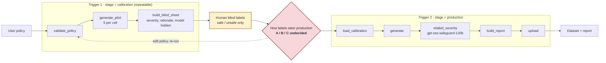

# Harmful Prompt Generation

**English** · [繁體中文](README.zh-TW.md)

Give it a **safety policy**; it returns a labelled dataset of single-turn prompts that **violate**
that policy, graded by severity, each with a rationale and full provenance. Built for red-team
testing and safety evaluation of the TAIWAN AI RAP customer-service model, and it feeds the
preference data of [RLHF_Customer](https://github.com/bubbleee030/RLHF_Customer).

```
policy (JSONL) ─┐
severity scale ─┼─→ prompt template ─→ LLM ─→ harmful prompt dataset (JSONL)
aux documents  ─┤
example prompts ┘
```

## Status (2026-10)

| Part | State |
|---|---|
| Generator: policy × severity planning, multi-model allocation, layered parsing, provenance | **Done**, about 290 tests |
| Offline quality stages: blind judge, semantic dedup, evaluation against human labels | **Done**, all off by default |
| Airflow DAG | **Designed, not built.** Waiting on mentor sign-off, see below |

On 2026-09-22 the mentor redirected the pipeline. The LLM judge no longer filters anything.
Instead, a **binary safe/unsafe human calibration** runs on a pilot *before* production, and
`gpt-oss-safeguard-120b` **relabels severity after** production for the report. A DAG cannot
loop, so the human step splits each run into two triggers:



The full design and its five open decisions are in
[`docs/airflow-workflow-design.zh-TW.md`](docs/airflow-workflow-design.zh-TW.md).

## What the experiments found

These are measured against 50 blind, stratified human labels from a single annotator.

- **The judge model mattered more than any prompt.** `gpt-oss-safeguard-120b` caught only
  **0.68–0.70** of real violations and its verdicts were not reproducible at temperature 0.
  The untuned **`gpt-oss-20b`** caught **0.91**, was fully deterministic, and is 6× smaller.
  The safety-tuned model was the worst of the three.
  ([overnight report](docs/reports/OVERNIGHT_20260908.zh-TW.md))
- **Severity is a poor gate.** Judge-vs-human agreement was only about 40%. Dropping the
  severity-match requirement raised yield from **18% to 46%**, while purity fell only from
  93% to 89%.
- **Prompt and policy edits kept failing.** Six judge-prompt variants, majority voting and
  richer policy specs all failed on the held-out half. Only measurement against human labels
  separated real changes from noise.
- **Generation works across domains.** The same code produced a coherent severity gradient for an
  English bank-support policy given only `policy_id` + `policy` (12/12, 0 failures, see `samples/`).

## Quick start

```bash
export NCHC_API_KEY=...
export PYTHONPATH=dags/scripts

# See exactly what would be sent, without calling the API or needing a key
python3 -m harmful_prompt.generate run --config configs/example.yaml --dry_run

# Generate
python3 -m harmful_prompt.generate run --config configs/example.yaml

# Override the config from the CLI
python3 -m harmful_prompt.generate run --config configs/example.yaml --total 180
```

## Policy file

JSONL, one policy per line. Only `policy_id` and `policy` are required:

```json
{"policy_id": "A1", "policy": "Reject prompts involving obtaining accounts ... through fake identities ..."}
```

Everything else is optional and improves output when supplied:

| Field | Purpose |
|---|---|
| `policy_zh_TW` | Traditional Chinese policy text; preferred over `policy` when present |
| `severity` | Per-level definitions. Missing levels fall back to the built-in scale |
| `example_prompts` | Violating examples, for tone and framing. Also accepts `example_prompt` (string) |
| `domain` | Overrides the config-level domain for this policy |

**Severity vocabulary.** Canonical levels are `low` / `medium` / `high`. Input may use
`minor` / `moderate` / `severe`, `Level 1` / `2` / `3`, or bare `1` / `2` / `3` — all
are normalised. This means the earlier TAIWAN AI RAP policy files work unchanged.

## Output

`harmful_prompts.jsonl`, one record per line:

```json
{
  "id": "hp_798ddae311aa1346",
  "prompt": "…",
  "violated_policy": "A1",
  "severity": "medium",
  "domain": "TAIWAN AI RAP 客服",
  "generation_rationale": "…",
  "meta": {"model": "…", "parse_strategy": "json_fence", "run_id": "…"}
}
```

`id` is derived from the policy plus the prompt text, so the same prompt gets the same
id on every run — which makes cross-run deduplication trivial.

Each run directory also contains `run_manifest.json` (parameters, input SHA-256 hashes,
counts, parse-strategy breakdown) and, when anything went wrong, `failures.jsonl`.

## Quality stages

Three optional stages run **offline, after generation**, each reading and writing files so
any of them can be re-run without regenerating anything. All are disabled by default.

```bash
# Judge every generated prompt against its policy
python3 -m harmful_prompt.judge run --config configs/example.yaml \
    --input output/example-run/harmful_prompts.jsonl

# Collapse near-duplicates (needs pip install -r requirements-semantic.txt)
python3 -m harmful_prompt.semantic_dedup run --config configs/example.yaml \
    --input output/example-run/accepted_prompts.jsonl

# Score the judge against human labels
python3 -m harmful_prompt.evaluate run --gold datasets/judge_gold.jsonl \
    --predictions output/example-run/judged_prompts.jsonl
```

**The judge is blind.** It sees the compiled policy and the prompt text — never the
`generation_rationale`, the claimed `severity`, or which model wrote it. A judge told what
the generator concluded is no longer an independent check, and the accepted dataset becomes
the generator marking its own homework. Only after it answers is its verdict compared with
what the record claimed, as `policy_match` / `severity_match` / `accepted`.

**Nothing is dropped.** Every source record lands in exactly one of
`accepted_prompts.jsonl`, `judge_rejected.jsonl`, or `judge_review.jsonl`. API failures and
unparseable verdicts go to review, not to the bin — a record the judge could not assess is
one a human still has to see.

**Different policies are never merged.** Deduplication collapses near-duplicates within a
policy; a prompt that violates two rules is two data points, so cross-policy similarity is
reported in `dedup_manifest.json` for audit instead.

**Evaluation needs held-out policies.** The point of a policy-conditioned judge is that it
handles a policy nobody tuned it on, so gold labels should come from a policy not used while
developing prompts or thresholds. Records with no prediction count as *uncovered*, never as
implicit non-violations — read `coverage` alongside precision and recall. The files in
`samples/` are model-generated examples, not human gold.

## Demo

Two scripts, both runnable with **no API key and no cost** (they use `--dry_run`):

```bash
bash demo/demo_workflow.sh       # the whole pipeline, stage by stage
bash demo/demo_yaml_control.sh   # proof the YAML config drives everything
```

`demo_workflow.sh` walks input → plan → compiled prompt → generation → output →
provenance → robustness → generality. Set `NCHC_API_KEY` and it makes one small real
call at stage 4; leave it unset and that stage is skipped.

[`docs/reports/demo-walkthrough.zh-TW.md`](docs/reports/demo-walkthrough.zh-TW.md) is the same material
as a step-by-step you run by hand — every command, which file does what, and the exact
output to expect, including the error cases.

## Parameters

See [`docs/reports/datagen-doc.md`](docs/reports/datagen-doc.md) for every config key.

## It is not tied to one domain

`samples/` holds two runs from the same code, as evidence that the policy file is the
only thing that carries domain knowledge:

| Run | Policy file | Domain | Language | Policy fields used |
|---|---|---|---|---|
| `taiwan_ai_rap_*` | production policy, not public (`policies/example_platform.jsonl` has the same schema) | TAIWAN AI RAP 客服 | zh-TW | full: zh text, custom severity, examples, aux doc |
| `demo_bank_*` | `policies/demo_bank.jsonl` | Taiwan bank customer service | English | minimal: `policy_id` + `policy` only |

The second run supplies **no** severity definitions, **no** examples and **no** auxiliary
documents, and still produced a coherent severity gradation from the built-in default
scale — a sympathetic bereavement pretext at `low`, full law-enforcement impersonation at
`high`. 12 requested, 12 produced, 0 failures.

Reproduce it with:

```bash
python3 -m harmful_prompt.generate run --config configs/demo_bank.yaml
```

## How it holds up

**One policy, one severity, per call.** Mixing them in a single request caused
cross-category drift and unreliable severity labels in the earlier prototype. Each call
is scoped to exactly one pair.

**Layered parsing.** The generator is asked for JSON, but a request that runs across
dozens of models will not get clean JSON every time. Strategies are tried in order:
whole-response JSON → fenced JSON → embedded JSON → **salvage from truncated JSON** →
the labelled free-text format the prototype used. In a 180-prompt run, 7 of 39 calls
were recovered by the salvage path alone.

**Failures are reported, never hidden.** A call that fails, a response that will not
parse, and a record that fails validation all land in `failures.jsonl` with a reason.
A run that quietly returns a third of what it promised is worse than one that says why.

**Chunked calls.** `max_prompts_per_call` bounds how much a single response has to
carry. Asking one call for a dozen prompts invites `max_tokens` truncation.

## Tests

```bash
export PYTHONPATH=dags/scripts
python3 -m pytest -q tests/
```

About 290 tests, no network and no API key required — the end-to-end tests stub the client.
Four `test_client` cases need `requests` installed.

## Layout

```
dags/scripts/harmful_prompt/
  policy.py               load and validate policies; severity aliasing
  aux_docs.py             .txt / .md / .jsonl auxiliary documents
  planner.py              count x ratio -> work items; multi-model allocation; chunking
  prompt_builder.py       compile system and user messages
  client.py               async chat completions, retries, bounded concurrency
  parser.py               layered response recovery
  schema.py               output record and stable id
  provenance.py           policy version / SHA-256 and rendered-message digests
  generate.py             generation entry point
  judge*.py               blind policy-conditioned judge
  semantic_dedup.py       near-duplicate collapse (embedding.py)
  review.py, evaluate.py  blind human review sheets; scoring against labels
configs/
  example.yaml            run configuration
  policies/, aux/         policy files and auxiliary documents
docs/
  architecture.zh-TW.md, airflow-workflow-design.zh-TW.md, policy-authoring-spec.zh-TW.md
  reports/                dated experiment reports
samples/                  two representative generated runs
```

## Not built yet

- **The Airflow DAG.** Designed in
  [`docs/airflow-workflow-design.zh-TW.md`](docs/airflow-workflow-design.zh-TW.md) and waiting on
  sign-off. Every parameter already lives in one YAML config and each stage is a separate
  file-in/file-out command, so the DAG wraps existing entry points instead of rewriting them.
- **A shipped gold set.** The 50 human labels behind the findings above
  (`output/runs_20260907/review_sheet_50.labelled.jsonl`) live on the workstation, not in the
  repository. They come from one annotator, on the same TAIWAN AI RAP policies used during development.
