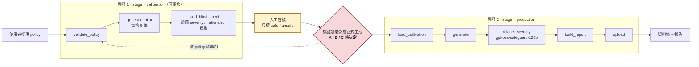

# Harmful Prompt 生成

[English](README.md) · **繁體中文**

給它一份**安全政策**，它會產出一批**違反**這份政策的單輪提示詞，每筆都附上 severity、生成理由和完整的來源紀錄。

這是為 TAIWAN AI RAP 客服模型的紅隊測試和安全評估而做的，產出也是 [RLHF_Customer](https://github.com/bubbleee030/RLHF_Customer) 偏好資料的來源。

```
policy (JSONL) ─┐
severity 定義  ─┼─→ prompt 模板 ─→ LLM ─→ 有害提示詞資料集 (JSONL)
輔助文件       ─┤
範例提示詞     ─┘
```

## 狀態（2026-10）

| 部分 | 狀態 |
|---|---|
| 生成器：policy × severity 配額、多模型分配、多層解析、來源紀錄 | **完成**，約 290 個測試 |
| 離線品質階段：盲判 judge、語意去重、對照人工標註的評估 | **完成**，預設全部關閉 |
| Airflow DAG | **已設計、尚未實作**，等 mentor 確認 |

2026-09-22 mentor 調整了流程方向，有三個改變：
- LLM judge 不再負責過濾任何資料。
- 正式生成**之前**，先拿一批 pilot 做**人工盲標**，只標 safe／unsafe，用來找出邊界。
- 正式生成**之後**，由 `gpt-oss-safeguard-120b` **重標 severity**，結果寫進報告。

因為 DAG 不能迴圈，人工標註這一步會把一次完整流程拆成兩次觸發：



完整設計和 5 個待決事項見 [`docs/airflow-workflow-design.zh-TW.md`](docs/airflow-workflow-design.zh-TW.md)。

## 實驗發現

以下都是對照 50 筆盲標、分層抽樣的人工標註量測的，標註者只有一位。

- **換裁判模型的效果，比改任何 prompt 都大。**
  - `gpt-oss-safeguard-120b` 只抓到 **0.68–0.70** 的真實違規，而且在 temperature 0 下結果仍不可重現。
  - 沒有做過安全微調的 **`gpt-oss-20b`** 抓到 **0.91**，結果完全可重現，模型還小 6 倍。
  - 經過安全微調的模型，反而是三個裡面最差的。
  - 詳見[夜間實驗報告](docs/reports/OVERNIGHT_20260908.zh-TW.md)。
- **severity 不適合當過濾門檻。** 裁判跟人工的 severity 一致率只有約 40%。拿掉 severity 必須相符的條件後，可用資料比例從 **18% 升到 46%**，純度只從 93% 降到 89%。
- **改 prompt 或補 policy 都沒用。** 六種裁判 prompt 變體、多數決投票、更完整的 policy 規格，全都在保留集上失敗。只有對照人工標註實測，才分得出真正的改進和雜訊。
- **生成器不綁定特定領域。** 換成英文的銀行客服 policy，而且只給 `policy_id` 和 `policy` 兩個欄位，同一份 code 仍然產出合理的 severity 梯度：要求 12 筆、產出 12 筆、0 失敗，見 `samples/`。

## 快速開始

```bash
export NCHC_API_KEY=...
export PYTHONPATH=dags/scripts

# 只看會送出什麼，不呼叫 API，也不需要 key
python3 -m harmful_prompt.generate run --config configs/example.yaml --dry_run

# 生成
python3 -m harmful_prompt.generate run --config configs/example.yaml
```

- 不需要 API key 的示範：`bash demo/demo_workflow.sh`。
- 手動逐步操作的中文說明：[`docs/reports/demo-walkthrough.zh-TW.md`](docs/reports/demo-walkthrough.zh-TW.md)。
- 每個設定參數：[`docs/reports/datagen-doc.md`](docs/reports/datagen-doc.md)。
- policy 要怎麼寫：[`docs/policy-authoring-spec.zh-TW.md`](docs/policy-authoring-spec.zh-TW.md)。
- 系統架構：[`docs/architecture.zh-TW.md`](docs/architecture.zh-TW.md)。

policy 檔格式、輸出欄位、品質階段、解析策略和目錄結構的完整說明，見[英文版 README](README.md)。

## 測試

```bash
export PYTHONPATH=dags/scripts
python3 -m pytest -q tests/
```

約 290 個測試，不需要網路，也不需要 API key。其中 4 個 `test_client` 測試要先裝 `requests`。
