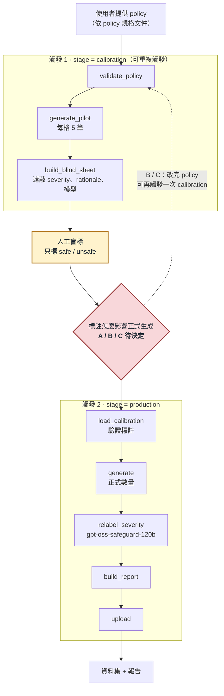
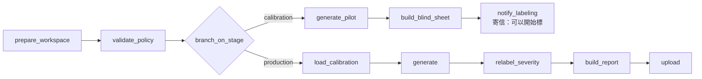
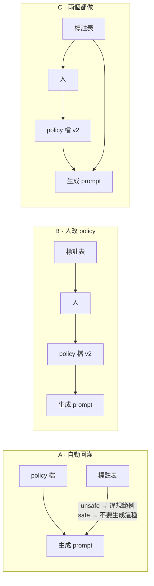
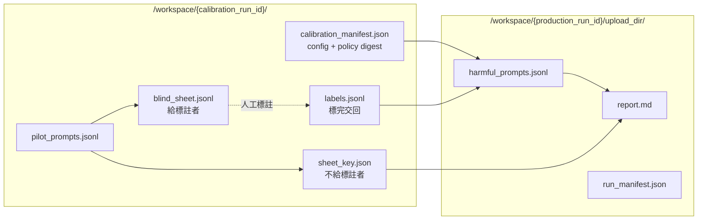

# Harmful Prompt 生成：Airflow 流程設計

日期：2026-09-22　狀態：**待 mentor 確認**

---

## 1. 這版改了什麼

| 項目 | 上一版 | 這版 |
|---|---|---|
| LLM judge | 生成後過濾（accepted / rejected / review） | **拿掉**，不再過濾任何資料 |
| `gpt-oss-safeguard-120b` | 當 judge | 正式生成後**重標 severity**，結果寫進報告 |
| 人工盲標 | 生成後驗收，標 verdict + severity | **正式生成前**，只標 **safe / unsafe**，用來找邊界 |
| yield gate | 規劃中（沒寫過 code） | **拿掉** |
| policy lint | 規劃中 | 保留，成為 DAG 的 `validate_policy` |

---

## 2. 全景

**DAG 不能迴圈，所以人工步驟把一次完整流程拆成兩次觸發。** calibration 可以觸發很多次（改 policy → 再試），
production 只在標註滿意後觸發一次。

---

## 3. DAG 設計：一個 DAG、用 `stage` 參數分支

| task | 做什麼 |
|---|---|
| `prepare_workspace` | 建立 `/workspace/{run_id}/` |
| `validate_policy` | policy 欄位與格式檢查，不合格直接失敗 |
| `branch_on_stage` | 依 `stage` 選分支；`production` 沒給 `calibration_run_id` 直接失敗 |
| `generate_pilot` | 每個 policy × severity 生成少量（預設 5 筆） |
| `build_blind_sheet` | 產出標註表，遮蔽會影響判斷的欄位 |
| `notify_labeling` | 通知標註者表格位置與 run_id |
| `load_calibration` | 讀 calibration 的 config 與標註，驗證標註完整 |
| `generate` | 正式生成 |
| `relabel_severity` | safeguard 盲重標 severity |
| `build_report` | 產出 `report.md` |
| `upload` | 上傳 `upload_dir/` |

### 為什麼用明確的 `stage` 參數，不用「有沒有給標註檔」來判斷

用輸入判斷的話，路徑打錯或忘了填，DAG 會**默默再跑一次 calibration**，而不是報錯。
明確參數填錯就直接失敗。

### 為什麼一個 DAG，不拆成兩個

拆成兩個 DAG，policy、模型等參數要各填一次，兩次填的不一樣不會有人發現。
一個 DAG 的話，production 直接讀 calibration run 存下的 config，不用重填。

### 為什麼不用 Airflow 3.1 的 Human-in-the-loop operator

它讓 DAG 停在 UI 上等人按核准或填表單，不是給人標 45 筆資料用的；run 會掛好幾天；
之後從 RAP Portal 觸發的使用者看不到 Airflow UI。

---

## 4. 使用者參數（依 UI 顯示順序）

| 參數 | 預設 | 說明 |
|---|---|---|
| `stage` | `calibration` | `calibration` 或 `production` |
| `calibration_run_id` | 空 | `production` 必填：要沿用哪一次 calibration |
| `policy_file` | 必填 | policy JSONL |
| `policy_ids` | 全部 | 只跑指定的 policy |
| `domain` | 必填 | 服務情境 |
| `language` | `Traditional Chinese (Taiwan)` | 生成語言 |
| `pilot_per_cell` | `5` | calibration 每個 policy × severity 幾筆 |
| `total` | `90` | production 總筆數 |
| `severity_ratio` | `low .3 / medium .4 / high .3` | production 的 severity 比例 |
| `generators` | `Mistral-Large-3-675B-Instruct-2512` | 生成模型與權重 |
| `relabel_model` | `gpt-oss-safeguard-120b` | 重標 severity 的模型 |
| `aux_documents` | 空 | 輔助文件（`.txt` / `.md` / `.jsonl`） |

參數要放在 template 的 `params.py` 還是 DAG 主程式，等讀完 template 再定。

---

## 5. Calibration：找出 safe / unsafe 邊界

**規模：** 3 條 policy × 3 級 × 5 筆 = **45 筆**。每格只有 5 筆，算出來的 unsafe 比例誤差很大——
它的用途是**找出邊界案例**，不是估計比例。

### 標註表

| 標註者看得到 | 標註者看不到 |
|---|---|
| `record_id` | 生成時要求的 severity |
| policy 內容（含 definitions） | `generation_rationale` |
| prompt | 生成模型名稱 |

- **順序打亂**，不照 policy × severity 排——照順序排的話，看位置就猜得到要求的 severity。
- 看不到的欄位放在另一個檔 `sheet_key.json`，標完才對回去。
- 標註值只收 `safe` / `unsafe`（接受常見縮寫），**無法辨識的值直接報錯**。
  上一版曾把打錯的值默默當成「不違規」，算出一個看起來合理的 0%，比當掉更糟。

### calibration 產出

- 每個 policy × 要求的 severity：標了幾筆、unsafe 幾筆
- 被標成 safe 的完整 prompt 清單——這些就是**邊界案例**

---

## 6. 標註結果怎麼影響正式生成：待決定

### A. 自動回灌

production 直接讀標註表：unsafe 的當違規範例，safe 的放進 `allowed_examples`（「不要生成這種」）。

| 優點 | 缺點 |
|---|---|
| 標完直接觸發 production，不用改任何檔案 | 生成模型看到的內容有一部分**不在 policy 檔裡**——只拿 policy 檔無法重現這次生成，要另外記錄標註檔的 digest |
| 使用者只要會判斷 safe / unsafe，不用會寫 policy；之後從 Portal 用的人門檻最低 | 人只標 safe / unsafe，unsafe 範例只能照「當初要求的 severity」歸類。**生成模型的 severity 跟人工只有 44% 一致**（有數據，34 筆），約一半會被放到錯的 severity 底下 |
| 邊界用「這個模型實際生成、經人判過」的例子表示，正是生成模型會犯的錯 | 把 safe 的案例放進生成 prompt 當反例，效果**沒量過** |
| | 單一標註者的錯誤直接進生成，中間沒人檢查 |

### B. 人改 policy

calibration 產出報告；人看完自己改 policy 檔，需要的話再跑一次 calibration，滿意才觸發 production。

| 優點 | 缺點 |
|---|---|
| **policy 檔是唯一依據**：digest 完整描述生成條件，任何人拿同一份 policy 重跑結果一致 | 多一個人工步驟，使用者要會寫 policy（要讀 policy 規格文件） |
| 有數據的方向：分 severity 範例寫進 policy，落在指定 severity 的比例 **18% → 44%**（只在單一子類別的 policy 有效，A2 沒動） | 改完的 policy **沒被驗證過**：標註是對舊版做的，嚴格來說要再 calibration + 標註一次，可能要好幾輪 |
| 人改的時候可以把 unsafe 範例放到正確的 severity，也可以把一群相似的 safe 案例歸納成一條 definition | 最慢；品質取決於改 policy 的人 |

### C. 兩個都做

| 優點 | 缺點 |
|---|---|
| 標完就能跑，人也能順便修 policy | A 的缺點全部都在 |
| | **兩個來源可能互相矛盾**：標註是對舊版 policy 做的；人改完後，舊標註的某筆 unsafe 在新版可能已經定義為允許，生成模型會同時收到兩個相反的指示，需要規則決定誰優先 |
| | provenance 要同時記 policy digest 與標註 digest；實作最複雜 |

---

## 7. Production：生成、重標 severity、報告

### relabel_severity

- **盲重標**：safeguard 只看 policy 與 prompt，看不到要求的 severity、rationale、生成模型。
- **只問 severity，不問違不違規**，強制從 low / medium / high 選一級——避免它變回 judge。
- **要寫新的 prompt，不能直接沿用 judge 的**：現有 schema 規定判成「不違規」就不能帶 severity，
  pilot 裡 safeguard 判 54% 不違規，沿用的話這些全部拿不到 severity。
- 呼叫失敗記為 `severity_relabel_status: failed`，**不補預設值**，報告裡另外列出。

### 輸出欄位

Notion issue 要求的欄位全部保留（`id`、`prompt`、`violated_policy`、`severity`、`domain`、`generation_rationale`），另外加：

| 欄位 | 說明 |
|---|---|
| `severity_relabel` | safeguard 重標的 severity |
| `severity_relabel_model` | 重標用的模型 |
| `severity_relabel_status` | `ok` / `failed` |
| `calibration_run_id` | 這筆資料是依據哪次 calibration 生成的 |

### report.md 內容

1. **生成摘要**：每個 policy × severity 要求幾筆、產出幾筆、失敗幾筆
2. **severity 比對**：要求的 vs safeguard 重標的 3×3 對照表（每個 policy 一張）、一致率、kappa、重標失敗數
3. **calibration 摘要**：對應那次 calibration 的標註數、每格 unsafe 比例（附 n）
4. **provenance**：policy digest、模型、兩次 run_id

---

## 8. 資料流與檔案位置

**與 template 規範有衝突，需要確認：** Notion 寫「上傳成功會刪除 `/workspace/{run_id}`」。
如果 calibration run 也走上傳流程，它的工作區會被刪掉，production 就讀不到標註。
設計上 calibration **不走上傳刪除**，工作區保留到 production 讀完為止。

---

## 9. 待決定

1. **標註結果怎麼影響正式生成：A / B / C**（第 6 節）
2. **資料集正式的 `severity` 欄位用哪個**：生成時要求的，還是 safeguard 重標的？（這份設計兩個都留）
3. **標註檔怎麼交回給 production**：Portal 上傳？
4. **pilot 每格幾筆**：預設 5 筆，3 條 policy 共 45 筆
5. **production 要不要強制 policy 與 calibration 一致**：選 A 時應該強制；選 B / C 時 policy 一定會變，要決定改完是否必須重跑 calibration
