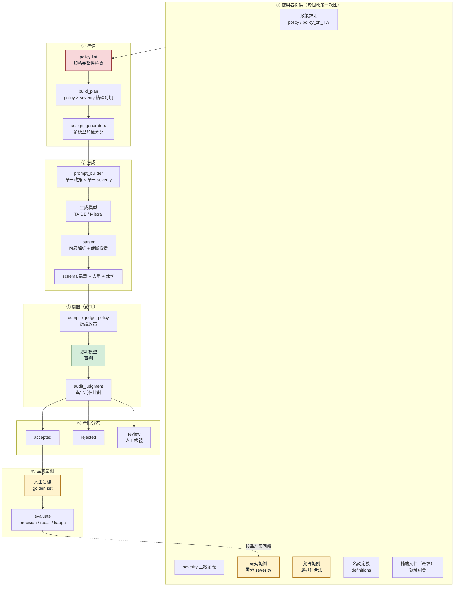
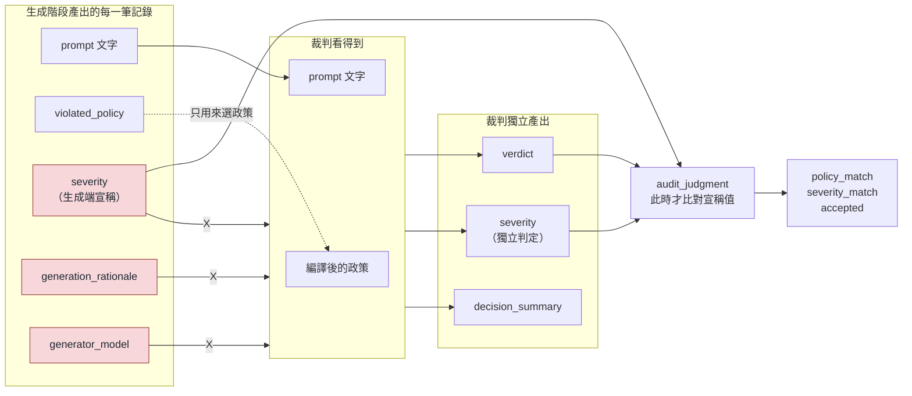
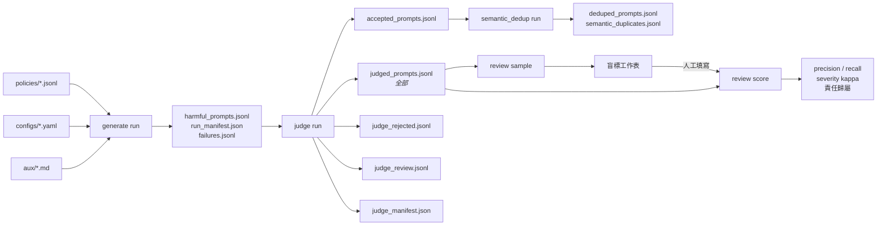
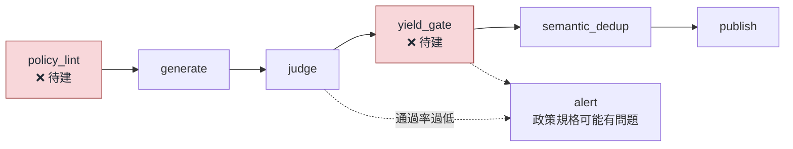

# 架構圖：從資料準備到驗證

本文件描述 harmful prompt 生成管線的完整流程。每個階段都是獨立的「讀檔 → 寫檔」指令，
可單獨重跑；Airflow DAG 只是在外層包裝這些既有進入點，不需重寫任何邏輯。

**圖上標註了三種狀態：** ✅ 已驗證可用、⚠️ 已知有缺陷、❌ 尚未建置。

---

## 1. 全景

---

## 2. 每個階段的狀態

| 階段 | 狀態 | 說明 |
|---|---|---|
| ① 使用者輸入 | ⚠️ | 規則／severity 定義已足夠；**違規範例需改為分 severity**（已支援，尚未全面填入）；允許範例與 definitions 目前多數為空 |
| ② policy lint | ❌ | **尚未建置。** 目前政策規格不完整不會有任何警告 |
| ② 配額分配 | ✅ | 在每個 policy × severity 分組內精確分配，已驗證 90/90、每格 10 筆 |
| ③ 生成 | ⚠️ | 可運作；**但只有約 30% 的產出落在要求的 severity** |
| ③ parser | ✅ | 四層解析 + 截斷救援；截斷發生在 rationale 時仍保留 prompt |
| ④ 裁判 | ✅ | 盲判、分流完整、無資料遺失；**模型選擇影響極大**（見第 4 節）|
| ⑤ 分流 | ✅ | 每筆必定落入且僅落入三者之一，已在 22 / 76 / 86 / 87 筆上驗證 |
| ⑥ 人工盲標 | ⚠️ | 工具已建置（`review.py`）；目前只有一位標註者、50 筆 |
| ⑥ evaluate | ✅ | 程式完成並測試；需要 golden set 才有意義 |

---

## 3. 生成階段：裁判看得到什麼、看不到什麼

裁判是**盲判**的，這是刻意設計：

**為什麼：** 一旦告訴裁判「生成模型認為這是 medium 違規」，判斷就不再獨立，
accepted 資料集會變成生成模型自己幫自己打分數。比對只在裁判獨立作答**之後**才發生。

---

## 4. 裁判模型的選擇（實測）

同一個 prompt、同一份政策、同一批 50 筆人工標註，每個模型跑 3 次：

| 模型 | recall | precision | 判定穩定性 |
|---|---|---|---|
| `gpt-oss-safeguard-120b` | 0.68–0.70 | 0.77–0.79 | 14% 會變 |
| `gpt-oss-120b`（base） | 0.88 | 0.75 | 完全穩定 |
| **`gpt-oss-20b`（base）** | **0.91** | 0.76 | 完全穩定 |

安全微調過的模型反而最差——它的後訓練是針對 moderation benchmark 的 precision，
那是另一個工作點。**三者 precision 幾乎相同，差別只在 recall。**

`Granite-Guardian-3.1-8B` 已評估並排除：它是固定 taxonomy，同一段 prompt 對照不同政策
有 4/6 次給相同答案，且只輸出 `Yes`/`No`，無法產出 severity 與理由。

---

## 5. 資料流與產出檔案

每個階段都寫入 SHA-256 provenance：政策雜湊、政策版本、渲染後訊息的雜湊、
實際使用的模型。任何一筆資料都可以追回它是用哪一版政策、哪個模型產生的。

---

## 6. 已知缺陷與對應處理

| 缺陷 | 影響 | 現況 |
|---|---|---|
| 生成 severity 校準 | 只有 ~30% 落在要求的等級 | **已改為分 severity 範例，待人工驗證** |
| policy lint 缺席 | 規格不完整不會被擋下 | ❌ 待建置 |
| 裁判 severity 不可靠 | 一致率 ~40%，kappa ~0.2 | 已停止作為驗收條件 |
| 只有一位標註者 | 無法區分「裁判太嚴」與「標註者太寬」 | ⚠️ 待第二位標註者 |
| API 空回應 | safeguard 模型約 5–7% 呼叫失敗 | 重試 + 送 review；base 模型無此問題 |

---

## 7. Airflow DAG 的對應

DAG 不需要重寫任何邏輯，每個 task 對應一個既有指令：

兩個尚未存在的閘門正是讓這套流程對「任意使用者政策」安全的關鍵：

- **policy_lint**：政策規格不完整（缺 severity 範例、缺允許範例）就擋下，不必人盯
- **yield_gate**：通過率異常低（例如先前 A2 的 80% 退回率）就警告，而不是靜默產出劣質資料
